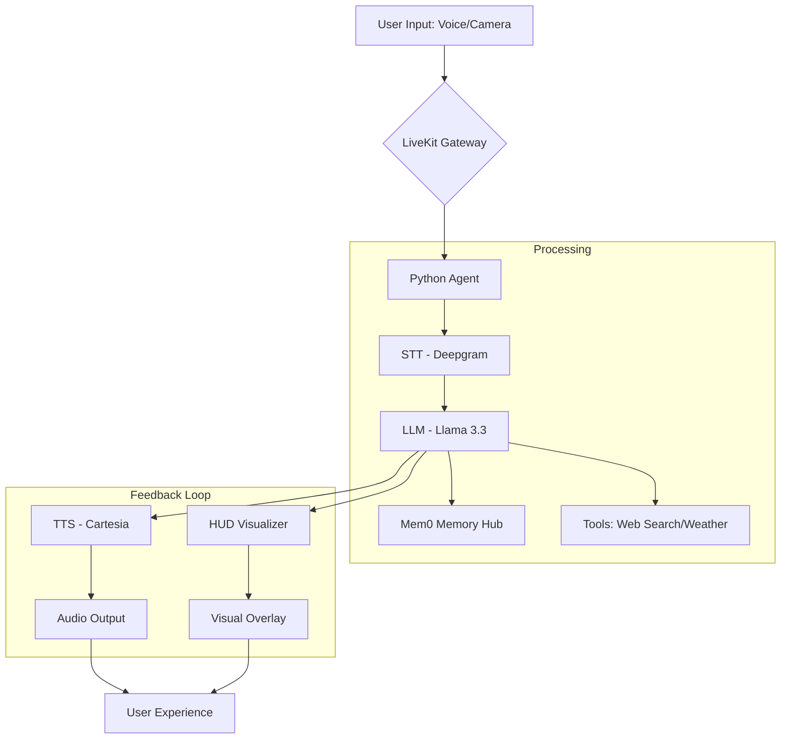

# GlassAi - Smart AI Glasses Documentation

Welcome to the **GlassAi** ecosystem. This project modernizes the concept of wearable intelligence, providing a hands-free, proactive AI assistant delivered via a first-person POV (Point of View) Head-Up Display (HUD).

## 👓 System Overview
GlassAi is conceptualized as a pair of smart glasses that "see" and "hear" what you do, providing contextual assistance, persistent memory, and proactive reminders.

### Key Value Propositions:
- **Zero Friction**: Completely voice-operated with visual HUD feedback.
- **Contextual Intelligence**: Remembers past conversations and personal details using Mem0.
- **Proactive Assistance**: Doesn't wait for you to ask; it reminds you of tasks based on time and context.
- **Visual Awareness**: Equipped with face recognition capabilities to identify people in your environment.

---

## 🏗️ Technical Architecture
The system is split into two primary layers: the **React-based HUD** and the **Python AI Core**.

### 1. The Intelligence Core (Backend)
- **STT**: Deepgram (Nova-3) for ultra-low latency transcription.
- **LLM**: Groq (Llama-3.3-70B) for rapid local-style reasoning.
- **TTS**: Cartesia (Sonic-3) for natural, expressive voice output.
- **Memory Engine**: Mem0 for long-term storage of user preferences and schedules.
- **Visual Perception**: OpenCV + DeepFace for real-time facial analysis.

### 2. The POV HUD (Frontend)
- **Dot Visualizer**: A pulsing, dynamic central element that represents the AI's "brain" and status.
- **LiveKit**: Real-time WebRTC connection for bidirectional audio and visual synchronization.

---

## 🔄 The Data Flow
How information moves from the world to your ears and eyes.

---

## 🛠️ Core Features & Capabilities

### 1. Persistent Memory (Mem0)
The system doesn't just process commands; it builds a profile.
- **Learning**: "I take my pills at 8 AM every day."
- **Retrieval**: "What's my morning routine?"
- **Automatic Sync**: Transcripts are analyzed at shutdown to update your profile.

### 2. Proactive Reminders
Every 3 minutes, a background "brain loop" checks your schedule.
- If it notices a task is approaching, it softly interrupts to give a reminder.
- Uses logic to ensure silence if nothing is urgent.

### 3. Visual Face Recognition
Equipped with a `face_watcher.py` module to:
- Identify people and link them to context.
- Register new faces dynamically.

---

## 📖 How to Use the System

### 1. Setup
1. **Backend**: `python agent/agent.py dev`
2. **Frontend**: `npm run dev` in the React folder.
3. **Connect**: Open HUD in browser -> Click **"Start Audio"**.

### 2. Interactions
- **Reminders**: "Remind me to buy groceries later."
- **Information**: "What's the weather?" or "Search for the latest AI news."
- **Memory**: "Do you remember my favorite drink?"

---

> [!TIP]
> **Proactive Tip**: Customize the AI's personality in `agent/prompts.py` to match your ideal "Glass" experience.
